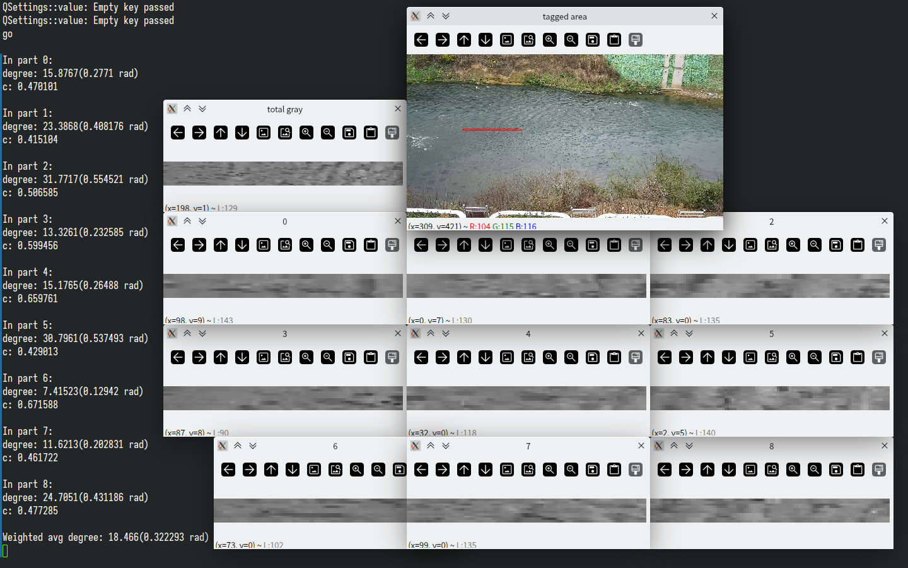
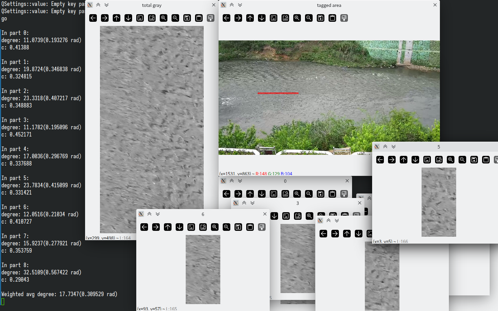

# 基于河流表面时空图像识别的测流方法求纹理角实践

理论基础、应用方向等信息参见此篇论文：[基于河流表面时空图像识别的测流方法](https://www.hanspub.org/journal/PaperInformation.aspx?paperID=33666&btwaf=52643139)。

本设计只负责实践。目前的进度为顺利求得纹理角（才疏学浅、条件有限）。

测试数据来自于“武大AiFlow视频测流”小程序河流监控视频，数据处理过程见[使用ffmpeg命令行初步处理河道监控视频 ](https://github.com/ShaoMengou/ffmpeg_taste)

涉及技术：OpenCV、FFMpeg、C++。

如果你想要编译本项目，可以使用此命令行：

```
g++ `pkg-config opencv4 --cflags --libs` stiv_angle.cpp
```

前提是你有gcc编译器并安装了opencv4库和pkg-config软件包。



